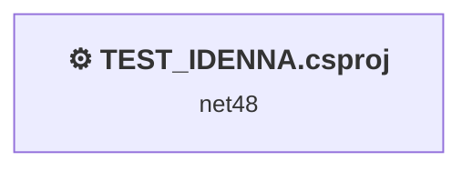
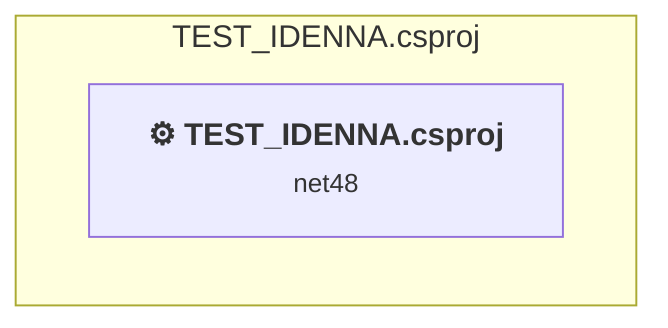

# Projects and dependencies analysis

This document provides a comprehensive overview of the projects and their dependencies in the context of upgrading to .NETCoreApp,Version=v10.0.

## Table of Contents

- [Executive Summary](#executive-Summary)
  - [Highlevel Metrics](#highlevel-metrics)
  - [Projects Compatibility](#projects-compatibility)
  - [Package Compatibility](#package-compatibility)
  - [API Compatibility](#api-compatibility)
- [Aggregate NuGet packages details](#aggregate-nuget-packages-details)
- [Top API Migration Challenges](#top-api-migration-challenges)
  - [Technologies and Features](#technologies-and-features)
  - [Most Frequent API Issues](#most-frequent-api-issues)
- [Projects Relationship Graph](#projects-relationship-graph)
- [Project Details](#project-details)

  - [TEST_IDENNA\TEST_IDENNA.csproj](#test_idennatest_idennacsproj)

## Executive Summary

### Highlevel Metrics

| Metric | Count | Status |
| :--- | :---: | :--- |
| Total Projects | 1 | All require upgrade |
| Total NuGet Packages | 64 | 36 need upgrade |
| Total Code Files | 25 |  |
| Total Code Files with Incidents | 16 |  |
| Total Lines of Code | 1078 |  |
| Total Number of Issues | 110 |  |
| Estimated LOC to modify | 63+ | at least 5.8% of codebase |

### Projects Compatibility

| Project | Target Framework | Difficulty | Package Issues | API Issues | Est. LOC Impact | Description |
| :--- | :---: | :---: | :---: | :---: | :---: | :--- |
| [TEST_IDENNA\TEST_IDENNA.csproj](#test_idennatest_idennacsproj) | net48 | 🟡 Medium | 45 | 63 | 63+ | ClassicWpf, Sdk Style = False |

### Package Compatibility

| Status | Count | Percentage |
| :--- | :---: | :---: |
| ✅ Compatible | 28 | 43.8% |
| ⚠️ Incompatible | 5 | 7.8% |
| 🔄 Upgrade Recommended | 31 | 48.4% |
| ***Total NuGet Packages*** | ***64*** | ***100%*** |

### API Compatibility

| Category | Count | Impact |
| :--- | :---: | :--- |
| 🔴 Binary Incompatible | 46 | High - Require code changes |
| 🟡 Source Incompatible | 2 | Medium - Needs re-compilation and potential conflicting API error fixing |
| 🔵 Behavioral change | 15 | Low - Behavioral changes that may require testing at runtime |
| ✅ Compatible | 663 |  |
| ***Total APIs Analyzed*** | ***726*** |  |

## Aggregate NuGet packages details

| Package | Current Version | Suggested Version | Projects | Description |
| :--- | :---: | :---: | :--- | :--- |
| MaterialDesignColors | 5.3.1 | 5.2.1 | [TEST_IDENNA.csproj](#test_idennatest_idennacsproj) | ⚠️El paquete NuGet no es compatible |
| MaterialDesignThemes | 5.3.1 | 5.2.1 | [TEST_IDENNA.csproj](#test_idennatest_idennacsproj) | ⚠️El paquete NuGet no es compatible |
| Microsoft.Bcl.AsyncInterfaces | 10.0.7 |  | [TEST_IDENNA.csproj](#test_idennatest_idennacsproj) | ✅Compatible |
| Microsoft.Bcl.Cryptography | 10.0.6 | 10.0.7 | [TEST_IDENNA.csproj](#test_idennatest_idennacsproj) | Se recomienda actualizar el paquete NuGet |
| Microsoft.Bcl.HashCode | 1.1.1 | 6.0.0 | [TEST_IDENNA.csproj](#test_idennatest_idennacsproj) | Se recomienda actualizar el paquete NuGet |
| Microsoft.Bcl.TimeProvider | 10.0.6 | 10.0.7 | [TEST_IDENNA.csproj](#test_idennatest_idennacsproj) | Se recomienda actualizar el paquete NuGet |
| Microsoft.CSharp | 4.7.0 |  | [TEST_IDENNA.csproj](#test_idennatest_idennacsproj) | ✅Compatible |
| Microsoft.Data.SqlClient | 7.0.0 |  | [TEST_IDENNA.csproj](#test_idennatest_idennacsproj) | ✅Compatible |
| Microsoft.Data.SqlClient.Extensions.Abstractions | 1.0.0 |  | [TEST_IDENNA.csproj](#test_idennatest_idennacsproj) | ✅Compatible |
| Microsoft.Data.SqlClient.Internal.Logging | 1.0.0 |  | [TEST_IDENNA.csproj](#test_idennatest_idennacsproj) | ✅Compatible |
| Microsoft.Data.SqlClient.SNI | 6.0.2 |  | [TEST_IDENNA.csproj](#test_idennatest_idennacsproj) | ⚠️El paquete NuGet no es compatible |
| Microsoft.Data.Sqlite.Core | 10.0.6 | 10.0.7 | [TEST_IDENNA.csproj](#test_idennatest_idennacsproj) | Se recomienda actualizar el paquete NuGet |
| Microsoft.DotNet.PlatformAbstractions | 3.1.6 |  | [TEST_IDENNA.csproj](#test_idennatest_idennacsproj) | ✅Compatible |
| Microsoft.EntityFrameworkCore | 3.1.32 | 10.0.7 | [TEST_IDENNA.csproj](#test_idennatest_idennacsproj) | Se recomienda actualizar el paquete NuGet |
| Microsoft.EntityFrameworkCore.Abstractions | 3.1.32 | 10.0.7 | [TEST_IDENNA.csproj](#test_idennatest_idennacsproj) | Se recomienda actualizar el paquete NuGet |
| Microsoft.EntityFrameworkCore.Analyzers | 3.1.32 | 10.0.7 | [TEST_IDENNA.csproj](#test_idennatest_idennacsproj) | Se recomienda actualizar el paquete NuGet |
| Microsoft.EntityFrameworkCore.Design | 3.1.32 | 10.0.7 | [TEST_IDENNA.csproj](#test_idennatest_idennacsproj) | Se recomienda actualizar el paquete NuGet |
| Microsoft.EntityFrameworkCore.Relational | 3.1.32 | 10.0.7 | [TEST_IDENNA.csproj](#test_idennatest_idennacsproj) | Se recomienda actualizar el paquete NuGet |
| Microsoft.EntityFrameworkCore.Sqlite | 3.1.32 | 10.0.7 | [TEST_IDENNA.csproj](#test_idennatest_idennacsproj) | Se recomienda actualizar el paquete NuGet |
| Microsoft.EntityFrameworkCore.Sqlite.Core | 3.1.32 | 10.0.7 | [TEST_IDENNA.csproj](#test_idennatest_idennacsproj) | Se recomienda actualizar el paquete NuGet |
| Microsoft.EntityFrameworkCore.Tools | 3.1.32 | 10.0.7 | [TEST_IDENNA.csproj](#test_idennatest_idennacsproj) | Se recomienda actualizar el paquete NuGet |
| Microsoft.Extensions.Caching.Abstractions | 10.0.6 | 10.0.7 | [TEST_IDENNA.csproj](#test_idennatest_idennacsproj) | Se recomienda actualizar el paquete NuGet |
| Microsoft.Extensions.Caching.Memory | 10.0.6 | 10.0.7 | [TEST_IDENNA.csproj](#test_idennatest_idennacsproj) | Se recomienda actualizar el paquete NuGet |
| Microsoft.Extensions.Configuration | 3.1.32 | 10.0.7 | [TEST_IDENNA.csproj](#test_idennatest_idennacsproj) | Se recomienda actualizar el paquete NuGet |
| Microsoft.Extensions.Configuration.Abstractions | 3.1.32 | 10.0.7 | [TEST_IDENNA.csproj](#test_idennatest_idennacsproj) | Se recomienda actualizar el paquete NuGet |
| Microsoft.Extensions.Configuration.Binder | 3.1.32 | 10.0.7 | [TEST_IDENNA.csproj](#test_idennatest_idennacsproj) | Se recomienda actualizar el paquete NuGet |
| Microsoft.Extensions.DependencyInjection | 10.0.7 |  | [TEST_IDENNA.csproj](#test_idennatest_idennacsproj) | ✅Compatible |
| Microsoft.Extensions.DependencyInjection.Abstractions | 10.0.7 |  | [TEST_IDENNA.csproj](#test_idennatest_idennacsproj) | ✅Compatible |
| Microsoft.Extensions.DependencyModel | 3.1.25 | 10.0.7 | [TEST_IDENNA.csproj](#test_idennatest_idennacsproj) | Se recomienda actualizar el paquete NuGet |
| Microsoft.Extensions.Logging | 3.1.32 | 10.0.7 | [TEST_IDENNA.csproj](#test_idennatest_idennacsproj) | Se recomienda actualizar el paquete NuGet |
| Microsoft.Extensions.Logging.Abstractions | 10.0.6 | 10.0.7 | [TEST_IDENNA.csproj](#test_idennatest_idennacsproj) | Se recomienda actualizar el paquete NuGet |
| Microsoft.Extensions.Options | 10.0.6 | 10.0.7 | [TEST_IDENNA.csproj](#test_idennatest_idennacsproj) | Se recomienda actualizar el paquete NuGet |
| Microsoft.Extensions.Primitives | 10.0.6 | 10.0.7 | [TEST_IDENNA.csproj](#test_idennatest_idennacsproj) | Se recomienda actualizar el paquete NuGet |
| Microsoft.IdentityModel.Abstractions | 8.17.0 |  | [TEST_IDENNA.csproj](#test_idennatest_idennacsproj) | ✅Compatible |
| Microsoft.IdentityModel.JsonWebTokens | 8.17.0 |  | [TEST_IDENNA.csproj](#test_idennatest_idennacsproj) | ✅Compatible |
| Microsoft.IdentityModel.Logging | 8.17.0 |  | [TEST_IDENNA.csproj](#test_idennatest_idennacsproj) | ✅Compatible |
| Microsoft.IdentityModel.Protocols | 8.17.0 |  | [TEST_IDENNA.csproj](#test_idennatest_idennacsproj) | ✅Compatible |
| Microsoft.IdentityModel.Protocols.OpenIdConnect | 8.17.0 |  | [TEST_IDENNA.csproj](#test_idennatest_idennacsproj) | ✅Compatible |
| Microsoft.IdentityModel.Tokens | 8.17.0 |  | [TEST_IDENNA.csproj](#test_idennatest_idennacsproj) | ✅Compatible |
| Microsoft.Xaml.Behaviors.Wpf | 1.1.142 | 1.1.39 | [TEST_IDENNA.csproj](#test_idennatest_idennacsproj) | ⚠️El paquete NuGet no es compatible |
| Newtonsoft.Json | 9.0.1 | 13.0.4 | [TEST_IDENNA.csproj](#test_idennatest_idennacsproj) | Se recomienda actualizar el paquete NuGet |
| SourceGear.sqlite3 | 3.50.4.5 |  | [TEST_IDENNA.csproj](#test_idennatest_idennacsproj) | ✅Compatible |
| SQLitePCLRaw.bundle_e_sqlite3 | 2.1.2 |  | [TEST_IDENNA.csproj](#test_idennatest_idennacsproj) | ✅Compatible |
| SQLitePCLRaw.bundle_green | 2.1.11 |  | [TEST_IDENNA.csproj](#test_idennatest_idennacsproj) | ✅Compatible |
| SQLitePCLRaw.core | 3.0.2 |  | [TEST_IDENNA.csproj](#test_idennatest_idennacsproj) | ✅Compatible |
| SQLitePCLRaw.lib.e_sqlite3 | 2.1.11 |  | [TEST_IDENNA.csproj](#test_idennatest_idennacsproj) | ⚠️El paquete NuGet está en desuso |
| SQLitePCLRaw.provider.dynamic_cdecl | 3.0.2 |  | [TEST_IDENNA.csproj](#test_idennatest_idennacsproj) | ✅Compatible |
| System.Buffers | 4.6.1 |  | [TEST_IDENNA.csproj](#test_idennatest_idennacsproj) | La funcionalidad del paquete NuGet se incluye con la referencia del marco |
| System.Collections.Immutable | 1.7.1 | 10.0.7 | [TEST_IDENNA.csproj](#test_idennatest_idennacsproj) | Se recomienda actualizar el paquete NuGet |
| System.ComponentModel.Annotations | 4.7.0 |  | [TEST_IDENNA.csproj](#test_idennatest_idennacsproj) | La funcionalidad del paquete NuGet se incluye con la referencia del marco |
| System.Diagnostics.DiagnosticSource | 10.0.6 | 10.0.7 | [TEST_IDENNA.csproj](#test_idennatest_idennacsproj) | Se recomienda actualizar el paquete NuGet |
| System.Formats.Asn1 | 10.0.6 | 10.0.7 | [TEST_IDENNA.csproj](#test_idennatest_idennacsproj) | Se recomienda actualizar el paquete NuGet |
| System.IdentityModel.Tokens.Jwt | 8.17.0 |  | [TEST_IDENNA.csproj](#test_idennatest_idennacsproj) | ✅Compatible |
| System.IO.Pipelines | 10.0.6 | 10.0.7 | [TEST_IDENNA.csproj](#test_idennatest_idennacsproj) | Se recomienda actualizar el paquete NuGet |
| System.Memory | 4.6.3 |  | [TEST_IDENNA.csproj](#test_idennatest_idennacsproj) | La funcionalidad del paquete NuGet se incluye con la referencia del marco |
| System.Numerics.Vectors | 4.6.1 |  | [TEST_IDENNA.csproj](#test_idennatest_idennacsproj) | La funcionalidad del paquete NuGet se incluye con la referencia del marco |
| System.Runtime.CompilerServices.Unsafe | 6.1.2 |  | [TEST_IDENNA.csproj](#test_idennatest_idennacsproj) | ✅Compatible |
| System.Runtime.InteropServices.RuntimeInformation | 4.3.0 |  | [TEST_IDENNA.csproj](#test_idennatest_idennacsproj) | La funcionalidad del paquete NuGet se incluye con la referencia del marco |
| System.Security.Cryptography.Pkcs | 10.0.6 | 10.0.7 | [TEST_IDENNA.csproj](#test_idennatest_idennacsproj) | Se recomienda actualizar el paquete NuGet |
| System.Text.Encodings.Web | 10.0.6 | 10.0.7 | [TEST_IDENNA.csproj](#test_idennatest_idennacsproj) | Se recomienda actualizar el paquete NuGet |
| System.Text.Json | 10.0.6 | 10.0.7 | [TEST_IDENNA.csproj](#test_idennatest_idennacsproj) | Se recomienda actualizar el paquete NuGet |
| System.Threading.Channels | 10.0.6 | 10.0.7 | [TEST_IDENNA.csproj](#test_idennatest_idennacsproj) | Se recomienda actualizar el paquete NuGet |
| System.Threading.Tasks.Extensions | 4.6.3 |  | [TEST_IDENNA.csproj](#test_idennatest_idennacsproj) | La funcionalidad del paquete NuGet se incluye con la referencia del marco |
| System.ValueTuple | 4.6.2 |  | [TEST_IDENNA.csproj](#test_idennatest_idennacsproj) | La funcionalidad del paquete NuGet se incluye con la referencia del marco |

## Top API Migration Challenges

### Technologies and Features

| Technology | Issues | Percentage | Migration Path |
| :--- | :---: | :---: | :--- |
| WPF (Windows Presentation Foundation) | 22 | 34.9% | WPF APIs for building Windows desktop applications with XAML-based UI that are available in .NET on Windows. WPF provides rich desktop UI capabilities with data binding and styling. Enable Windows Desktop support: Option 1 (Recommended): Target net9.0-windows; Option 2: Add <UseWindowsDesktop>true</UseWindowsDesktop>. |
| Legacy Configuration System | 2 | 3.2% | Legacy XML-based configuration system (app.config/web.config) that has been replaced by a more flexible configuration model in .NET Core. The old system was rigid and XML-based. Migrate to Microsoft.Extensions.Configuration with JSON/environment variables; use System.Configuration.ConfigurationManager NuGet package as interim bridge if needed. |

### Most Frequent API Issues

| API | Count | Percentage | Category |
| :--- | :---: | :---: | :--- |
| T:System.Uri | 8 | 12.7% | Behavioral Change |
| M:System.Windows.Controls.UserControl.#ctor | 8 | 12.7% | Binary Incompatible |
| T:System.Windows.Application | 7 | 11.1% | Binary Incompatible |
| M:System.Uri.#ctor(System.String,System.UriKind) | 7 | 11.1% | Behavioral Change |
| M:System.Windows.Application.LoadComponent(System.Object,System.Uri) | 6 | 9.5% | Binary Incompatible |
| T:System.Windows.Markup.IComponentConnector | 5 | 7.9% | Binary Incompatible |
| T:System.Windows.Controls.UserControl | 4 | 6.3% | Binary Incompatible |
| E:System.Windows.Input.CommandManager.RequerySuggested | 2 | 3.2% | Binary Incompatible |
| M:System.Windows.Application.#ctor | 2 | 3.2% | Binary Incompatible |
| M:System.Windows.Window.#ctor | 2 | 3.2% | Binary Incompatible |
| T:System.Windows.RoutedEventHandler | 2 | 3.2% | Binary Incompatible |
| M:System.Windows.Markup.InternalTypeHelper.#ctor | 1 | 1.6% | Binary Incompatible |
| T:System.Windows.Markup.InternalTypeHelper | 1 | 1.6% | Binary Incompatible |
| M:System.Configuration.ApplicationSettingsBase.#ctor | 1 | 1.6% | Source Incompatible |
| T:System.Configuration.ApplicationSettingsBase | 1 | 1.6% | Source Incompatible |
| M:System.Windows.Application.Run | 1 | 1.6% | Binary Incompatible |
| P:System.Windows.Application.StartupUri | 1 | 1.6% | Binary Incompatible |
| T:System.Windows.StartupEventArgs | 1 | 1.6% | Binary Incompatible |
| T:System.Windows.RoutedEventArgs | 1 | 1.6% | Binary Incompatible |
| E:System.Windows.Controls.ListBoxItem.Selected | 1 | 1.6% | Binary Incompatible |
| T:System.Windows.Window | 1 | 1.6% | Binary Incompatible |

## Projects Relationship Graph

Legend:
📦 SDK-style project
⚙️ Classic project

## Project Details

### TEST_IDENNA\TEST_IDENNA.csproj

#### Project Info

- **Current Target Framework:** net48
- **Proposed Target Framework:** net10.0-windows
- **SDK-style**: False
- **Project Kind:** ClassicWpf
- **Dependencies**: 0
- **Dependants**: 0
- **Number of Files**: 26
- **Number of Files with Incidents**: 16
- **Lines of Code**: 1078
- **Estimated LOC to modify**: 63+ (at least 5.8% of the project)

#### Dependency Graph

Legend:
📦 SDK-style project
⚙️ Classic project

### API Compatibility

| Category | Count | Impact |
| :--- | :---: | :--- |
| 🔴 Binary Incompatible | 46 | High - Require code changes |
| 🟡 Source Incompatible | 2 | Medium - Needs re-compilation and potential conflicting API error fixing |
| 🔵 Behavioral change | 15 | Low - Behavioral changes that may require testing at runtime |
| ✅ Compatible | 663 |  |
| ***Total APIs Analyzed*** | ***726*** |  |

#### Project Technologies and Features

| Technology | Issues | Percentage | Migration Path |
| :--- | :---: | :---: | :--- |
| Legacy Configuration System | 2 | 3.2% | Legacy XML-based configuration system (app.config/web.config) that has been replaced by a more flexible configuration model in .NET Core. The old system was rigid and XML-based. Migrate to Microsoft.Extensions.Configuration with JSON/environment variables; use System.Configuration.ConfigurationManager NuGet package as interim bridge if needed. |
| WPF (Windows Presentation Foundation) | 22 | 34.9% | WPF APIs for building Windows desktop applications with XAML-based UI that are available in .NET on Windows. WPF provides rich desktop UI capabilities with data binding and styling. Enable Windows Desktop support: Option 1 (Recommended): Target net9.0-windows; Option 2: Add <UseWindowsDesktop>true</UseWindowsDesktop>. |

